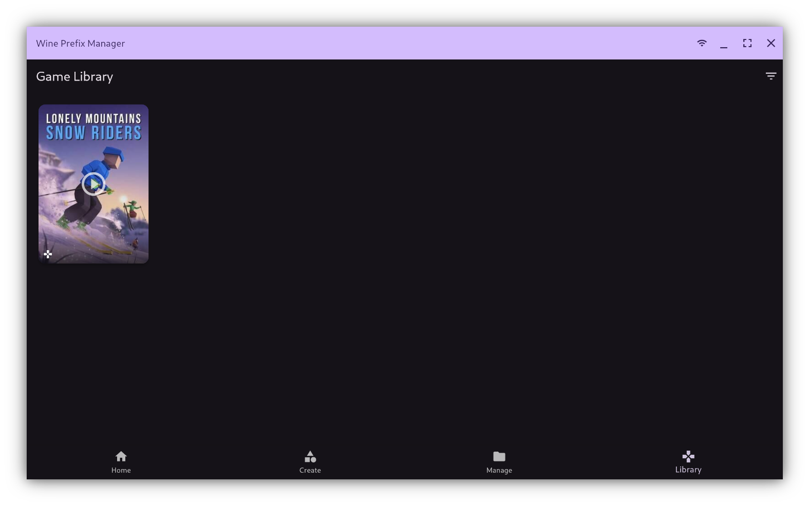
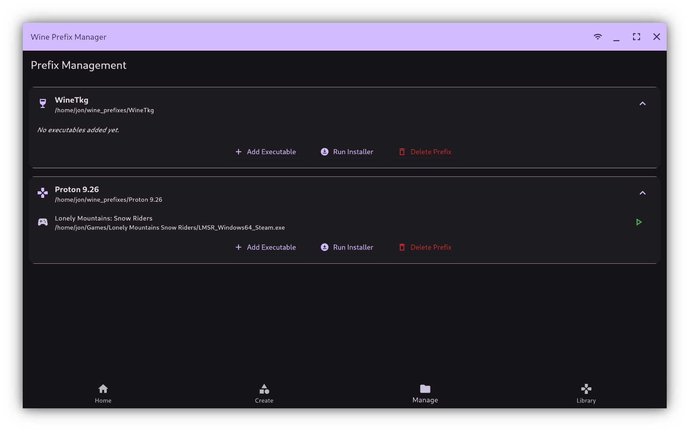
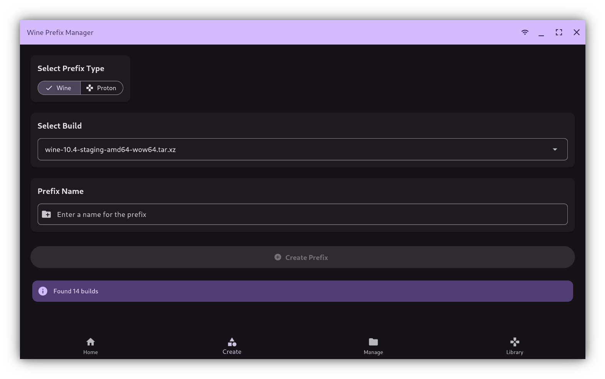

# Wine Prefix Manager

A Flutter application for managing Wine/Proton prefixes on Linux.

## Features

*   Scan for existing Wine/Proton prefixes in a specified directory.

## Screenshots


  


*   Create new Wine/Proton prefixes using downloaded builds (e.g., GE-Proton, Wine-GE).
*   Add Windows executables (`.exe`) to prefixes.
*   Identify games using IGDB integration (requires API credentials).
*   Download cover art and screenshots for identified games.
*   Launch executables/games within their respective prefixes.
*   Manage game categories.
*   Move game folders between locations.
*   Configurable paths for prefix storage and game library data.
*   Light/Dark theme support.

## Getting Started

### Download and Run (Standalone Executable)

Pre-built AppImage releases are available on the [Releases page](https://github.com/yourusername/wine_prefix_manager/releases).

1. Download the latest `.AppImage` file
2. Make it executable:
   ```bash
   chmod +x Wine_Prefix_Manager-*.AppImage
   ```
3. Run it:
   ```bash
   ./Wine_Prefix_Manager-*.AppImage
   ```

### Prerequisites (For Building from Source)

#### Core Requirements
*   Flutter SDK installed (Linux desktop support enabled: `flutter config --enable-linux-desktop`)
*   Wine or Proton (GE-Proton recommended) installed on your system
*   `git` (for cloning and version control)

#### Optional Tools
*   `zenity` (used as a fallback file picker)
*   `zip` (for creating release archives via the build script)

#### Recommended
*   Vulkan drivers installed for best gaming performance
*   GPU drivers properly configured for your hardware
*   At least 20GB free disk space for game installations

### Building and Running

1.  Clone the repository:
    ```bash
    git clone <repository-url>
    cd wine_prefix_manager
    ```
2.  Get dependencies:
    ```bash
    flutter pub get
    ```
3.  Run in development mode:
    ```bash
    flutter run -d linux
    ```
    Alternatively, use the provided script:
    ```bash
    ./build_run_deploy.sh
    # Select option 2
    ```

### Building a Release

Use the provided script:
```bash
./build_run_deploy.sh
# Select option 1 (Build Release)
# or option 5 (Build and Create Zip)
```
The release build will be in `build/linux/x64/release/bundle/`.
A zip archive (if created) will be in the `dist/` directory.

### Deployment (Optional)

The `build_run_deploy.sh` script offers options for user-local or system-wide deployment, which includes creating a `.desktop` file and symlinks. Use with caution, especially system-wide deployment which requires `sudo`.

## Configuration

Settings are stored in `$HOME/.wine_prefix_manager_settings.json`. The application provides a Settings page to configure:

*   **Prefix Directory:** The main directory to scan for and create prefixes.
*   **Game Library File Path:** (Optional) Path to store the JSON file containing prefix and game data. Defaults to `$HOME/.wine_prefix_manager.json`.
*   **IGDB API Credentials:** Client ID and Secret for fetching game information from IGDB.
*   **Appearance:** Dark/Light mode.
*   **Game Library:** Cover size preferences.
*   **Game Categories:** Manage custom categories for organizing games.

## Contributing

Contributions are welcome! Please feel free to submit issues or pull requests.

## License

[Specify License Here - e.g., MIT]
