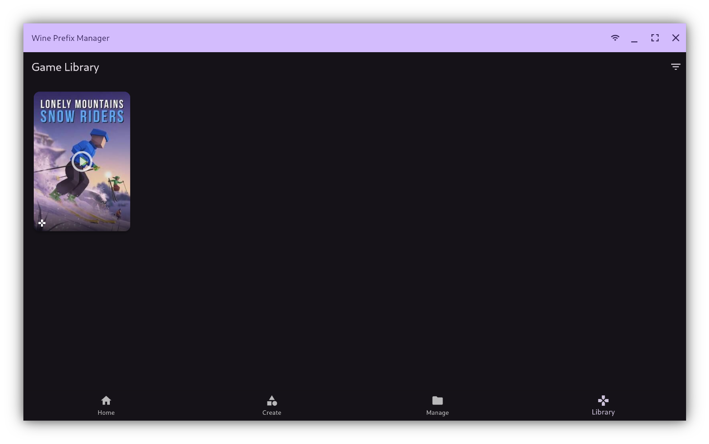

# Wine Prefix Manager

A modern Flutter application for managing Wine/Proton prefixes on Linux with built-in IGDB integration for automatic game metadata.



## ✨ Features

- **Modern Flutter UI** - Beautiful, responsive interface with dark/light themes
- **Built-in IGDB Integration** - Automatic game metadata, cover art, and screenshots
- **Comprehensive Prefix Management** - Create, manage, and organize Wine/Proton prefixes
- **Game Library** - Visual game library with categories and search
- **Backup & Restore** - Complete backup system for games and prefixes
- **Proton Integration** - Seamless Steam Proton support
- **File Management** - Browse and manage prefix files directly
- **One-Click AppImage** - Portable, no-installation-required distribution

### Automatic Prefix Setup
- Microsoft Visual C++ 2015-2022 Redistributable (x64/x86)
- Game controller registry fixes (DisableHidraw, SDL winebus)
- Essential gaming dependencies (DXVK, VKD3D for 64-bit prefixes)
- Proton-specific optimizations for different Proton variants

## 🚀 Quick Start

### For Users

1. **Download the latest AppImage** from [Releases](https://github.com/CrownParkComputing/wine_prefix_manager/releases)
2. **Make it executable:**
   ```bash
   chmod +x WinePrefixManager-*.AppImage
   ```
3. **Run it:**
   ```bash
   ./WinePrefixManager-*.AppImage
   ```

### For Developers

1. **Clone and setup:**
   ```bash
   git clone https://github.com/CrownParkComputing/wine_prefix_manager.git
   cd wine_prefix_manager
   make setup
   ```

2. **Development build:**
   ```bash
   make build
   flutter run -d linux
   ```

## 🔧 Development

### Prerequisites
- Flutter SDK (latest stable) with Linux desktop support enabled
- Wine or Proton installed
- Git

### Essential Commands
```bash
# Setup development environment
make setup

# Build the application
make build

# Run tests and checks
make test
make lint
make format

# Clean build artifacts
make clean

# Check version synchronization
make version-check
```

## 📦 Building Releases

### Quick Release (Recommended)
```bash
# Complete release workflow: tag + build + GitHub release
make release-all VERSION=3.2.0
```

### Step-by-Step Release
```bash
# 1. Create and push version tag
make tag-release VERSION=3.2.0

# 2. Build AppImage
make appimage

# 3. Create GitHub release
make github-release VERSION=3.2.0
```

### Secure Build (with IGDB credentials)
```bash
# Set environment variables
export IGDB_CLIENT_ID=your_client_id
export IGDB_CLIENT_SECRET=your_client_secret

# Build with credentials
./scripts/build_with_env.sh patch
```

## 🔐 IGDB Integration

For end users, IGDB integration works out of the box. For developers building from source:

1. **Copy environment template:**
   ```bash
   cp env.example .env
   ```

2. **Get IGDB credentials** (see [IGDB_SETUP.md](IGDB_SETUP.md))

3. **Add to `.env` file:**
   ```env
   IGDB_CLIENT_ID=your_client_id_here
   IGDB_CLIENT_SECRET=your_client_secret_here
   ```

## 📁 Project Structure

```
wine_prefix_manager/
├── lib/                    # Flutter source code
├── scripts/               # Build and utility scripts
│   ├── build_with_env.sh  # Secure build with env vars
│   ├── build_appimage.sh  # AppImage creation
│   ├── create_github_release.sh  # GitHub release automation
│   └── check_version_sync.sh     # Version management
├── website/               # Project website
├── Makefile              # Main build orchestration
├── pubspec.yaml          # Flutter dependencies
├── IGDB_SETUP.md         # IGDB setup guide
└── README.md             # This file
```

## 🛠️ Available Scripts

| Script | Purpose | Usage |
|--------|---------|-------|
| `make setup` | Development environment setup | One-time setup |
| `make build` | Build Flutter app | Development |
| `make appimage` | Create AppImage distribution | Release |
| `make release-all VERSION=x.y.z` | Complete release workflow | Release |
| `./scripts/build_with_env.sh` | Secure build with env vars | Production |

## 🔍 Troubleshooting

### Common Issues

1. **Flutter not found**
   ```bash
   flutter config --enable-linux-desktop
   flutter doctor
   ```

2. **IGDB integration not working**
   - For users: Should work automatically
   - For developers: Check [IGDB_SETUP.md](IGDB_SETUP.md)

3. **AppImage won't run**
   ```bash
   # Install FUSE if needed
   sudo apt install fuse  # Ubuntu/Debian
   sudo pacman -S fuse    # Arch Linux
   ```

### Debug Logs
Logs are available in the app under the "Logs" tab, or run with:
```bash
flutter run -d linux --verbose
```

## 🤝 Contributing

1. Fork the repository
2. Create a feature branch
3. Make your changes
4. Run `make pre-commit` to ensure code quality
5. Submit a pull request

## 📄 License

Released under MIT License. See LICENSE file for details.

---

**Why Choose Wine Prefix Manager?**
- 🎯 **Gaming-focused** - Designed specifically for Linux gamers
- 🚀 **Zero configuration** - Works out of the box
- 🔄 **Built-in everything** - IGDB, backups, file management included
- 🎨 **Modern UI** - Beautiful Flutter interface
- 📦 **Portable** - Single AppImage file, no installation needed
