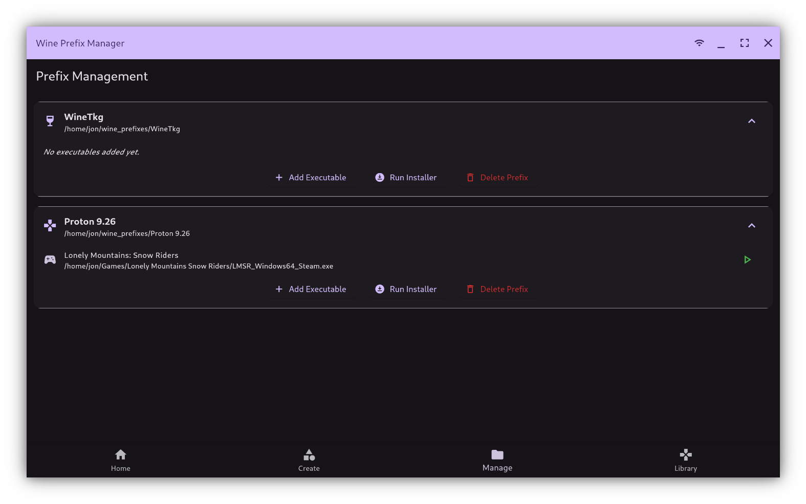
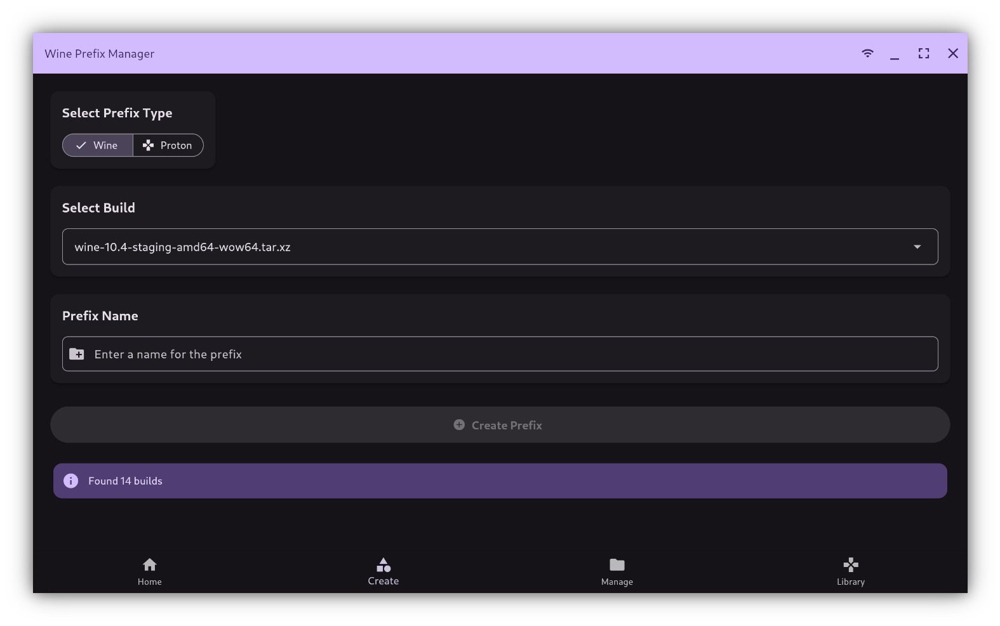

# Wine Prefix Manager

A Flutter application for managing Wine/Proton prefixes on Linux.

## Features

*   Scan for existing Wine/Proton prefixes in a specified directory.

## Screenshots


  


*   Create new Wine/Proton prefixes using downloaded builds (e.g., GE-Proton, Wine-GE).
*   Add Windows executables (`.exe`) to prefixes.
*   Identify games using IGDB integration (requires API credentials).
*   Download cover art and screenshots for identified games.
*   Launch executables/games within their respective prefixes.
*   Manage game categories.
*   Move game folders between locations.
*   Configurable paths for prefix storage and game library data.
*   Light/Dark theme support.

## Getting Started

### Download and Run (Standalone Package)

Pre-built binary packages are available on the [Releases page](https://github.com/yourusername/wine_prefix_manager/releases).

1. Download the latest release for your distribution
2. Extract the archive:
   ```bash
   tar -xzf wine_prefix_manager-*.tar.gz
   ```
3. Run the executable:
   ```bash
   ./wine_prefix_manager-*/bin/wine_prefix_manager
   ```

### Installing Dependencies Only

For users who don't want to build from source but need to install dependencies:

1. Download and make the dependency installer script executable:
   ```bash
   chmod +x scripts/install_dependencies.sh
   ```

2. Run the dependency installer:
   ```bash
   ./scripts/install_dependencies.sh
   ```

   The script will automatically detect your Linux distribution and install the required packages. You can also specify your distribution with `--distro`:
   ```bash
   ./scripts/install_dependencies.sh --distro ubuntu
   ```

   Supported distributions: ubuntu, debian, fedora, arch, manjaro

### Prerequisites (For Building from Source)

#### Core Requirements
*   Flutter SDK installed (Linux desktop support enabled: `flutter config --enable-linux-desktop`)
*   Wine or Proton (GE-Proton recommended) installed on your system
*   `git` (for cloning and version control)

#### Optional Tools
*   `zenity` (used as a fallback file picker)
*   `zip` (for creating release archives via the build script)

#### Recommended
*   Vulkan drivers installed for best gaming performance
*   GPU drivers properly configured for your hardware
*   At least 20GB free disk space for game installations

### Building and Running

1.  Clone the repository:
    ```bash
    git clone <repository-url>
    cd wine_prefix_manager
    ```

2.  Install dependencies:
    ```bash
    # Using the dependency installer script
    ./scripts/install_dependencies.sh
    ```
    
3.  Use the debug script for development:
    ```bash
    # Build and run in debug mode
    ./scripts/debug_build_run.sh
    
    # Build only without running
    ./scripts/debug_build_run.sh --build-only
    
    # Run existing build without rebuilding
    ./scripts/debug_build_run.sh --run-only
    
    # Clean build and run
    ./scripts/debug_build_run.sh --clean
    ```
    
    Or use Flutter commands directly:
    ```bash
    flutter pub get
    flutter run -d linux
    ```

### Building a Release

Use the release scripts:

```bash
# Simple release build
./scripts/build_release.sh

# Advanced release with version management
./scripts/build_and_release.sh --increment patch
```

The release build will be in `build/linux/x64/release/bundle/` and the packaged release will be in the `release/` directory.

## Understanding the Scripts

### Development Script

The `debug_build_run.sh` script simplifies the development workflow by:
- Getting Flutter dependencies
- Building the application in debug mode
- Running the application for testing
- Offering options to clean, build-only, or run-only

### Release Scripts

The project includes two release scripts:

1. **build_release.sh**: A straightforward script for basic release builds
   - Cleans previous builds
   - Gets Flutter dependencies
   - Builds the application in release mode
   - Creates a distributable tar.gz package
   - Generates SHA256 checksums
   
2. **build_and_release.sh**: A comprehensive script with advanced options
   - Handles version management (increments version numbers)
   - Supports different distribution formats (tar.gz, Arch packages)
   - Can push changes to Git repositories
   - Handles GitHub releases (when configured)

### Version Management

Versions are managed in the `pubspec.yaml` file and follow semantic versioning (MAJOR.MINOR.PATCH). The build scripts automatically extract the current version from this file.

```yaml
# Example from pubspec.yaml
version: 1.8.3
```

### Building for Different Distributions

The build system supports creating packages for different Linux distributions:

```bash
# Build for Arch Linux
./scripts/build_and_release.sh --distro arch
```

### Creating a Full Release

To create a complete release with all assets:

```bash
# Increment patch version and create all release packages
./scripts/build_and_release.sh --increment patch
```

This will:
1. Increment the patch version in pubspec.yaml
2. Update the CHANGELOG.md file
3. Build the application in release mode
4. Create distribution packages in the `release/` directory
5. Generate source code archive

## Configuration

Settings are stored in `$HOME/.wine_prefix_manager_settings.json`. The application provides a Settings page to configure:

*   **Prefix Directory:** The main directory to scan for and create prefixes.
*   **Game Library File Path:** (Optional) Path to store the JSON file containing prefix and game data. Defaults to `$HOME/.wine_prefix_manager.json`.
*   **IGDB API Credentials:** Client ID and Secret for fetching game information from IGDB.
*   **Appearance:** Dark/Light mode.
*   **Game Library:** Cover size preferences.
*   **Game Categories:** Manage custom categories for organizing games.

## Adding Executables to Prefixes

You can add Windows executables (.exe files) to Wine prefixes directly from the main game screen:

1. Click the floating "+" button at the bottom right of the screen
2. Select a prefix from the list
3. Browse and select an executable
4. Specify whether it's a game or application
5. If it's a game, you can fetch metadata from IGDB

Alternatively, you can add an executable to a specific prefix by clicking the "+" button next to the prefix name in the game library.

## Troubleshooting

### Common Issues

1. **File picker not working**: Ensure `zenity` is installed on your system.
2. **Wine/Proton not found**: Check that Wine or Proton is installed and paths are correctly configured in settings.
3. **IGDB integration not working**: Verify your API credentials in the Settings page.

### Debug Logs

Logs are available within the application under the Logs tab. For more detailed logs:
```bash
# Run the app in debug mode with verbose logging
./scripts/debug_build_run.sh
```

## Requirements

* Flutter SDK (latest stable version recommended)
* Linux system with GTK3
* Wine or Proton (for running Windows executables)
* For building packages:
  * Arch Linux: `base-devel`
  * Debian/Ubuntu: `dpkg-dev`, `fakeroot`
  * Fedora/RHEL: `rpm-build`, `rpmdevtools`

## Building and Installing

### Using the Menu System

The easiest way to build Wine Prefix Manager is to use the interactive menu system:

```bash
# Make the menu script executable
chmod +x scripts/menu.sh

# Run the menu
./scripts/menu.sh
```

The menu provides options for:
* Building packages for specific distributions (Arch, Debian, RPM)
* Creating a full release with version increment
* Debug building and running
* Installing dependencies

### Manual Building

You can also use the build scripts directly:

```bash
# Install dependencies for your distribution
./scripts/install_dependencies.sh

# Build a release for Arch Linux
./scripts/build_and_release.sh --distro arch --skip-git

# Build a release for Debian/Ubuntu
./scripts/build_and_release.sh --distro debian --skip-git

# Build a release for RPM-based distributions
./scripts/build_and_release.sh --distro rpm --skip-git
```

### Installing from Packages

After building, you can find the packages in the `release` directory:
* Arch Linux: Use the PKGBUILD file to create and install a package
* Debian/Ubuntu: Install the .deb file with `sudo dpkg -i <package.deb>`
* RPM: Install the .rpm file with `sudo rpm -i <package.rpm>`

## Contributing

Contributions are welcome! Please feel free to submit issues or pull requests.

## License

[Specify License Here - e.g., MIT]
